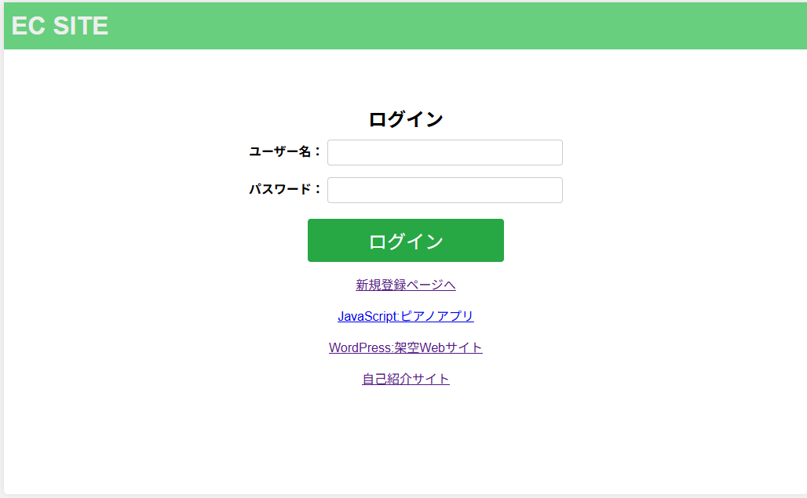
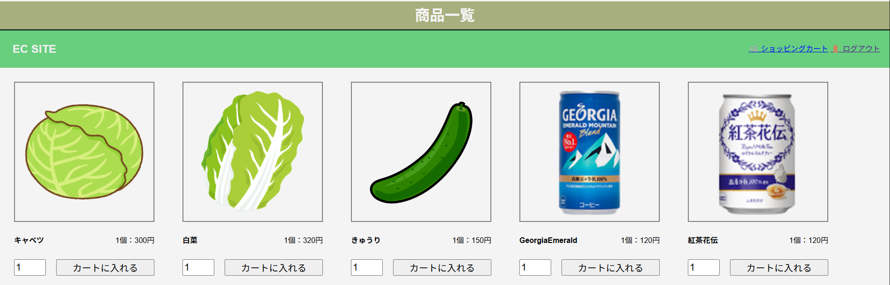
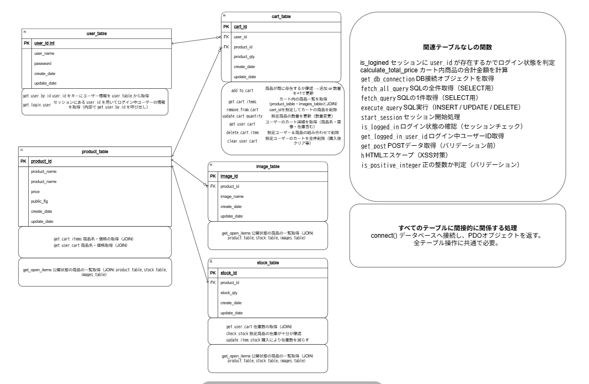
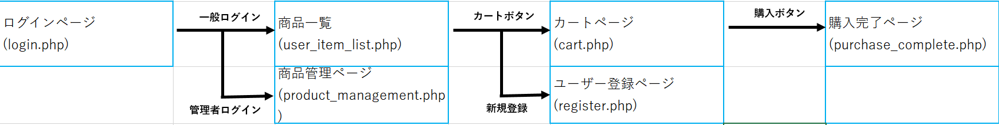
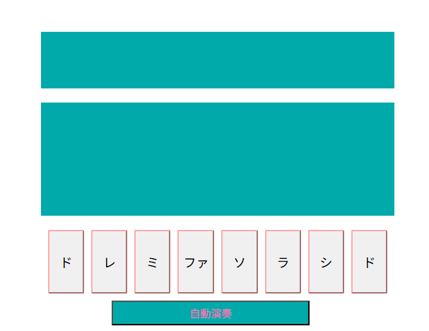
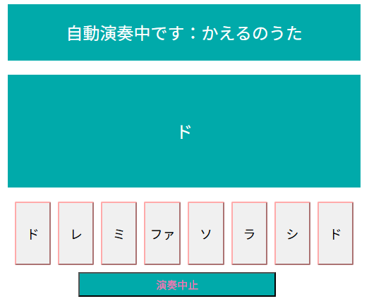
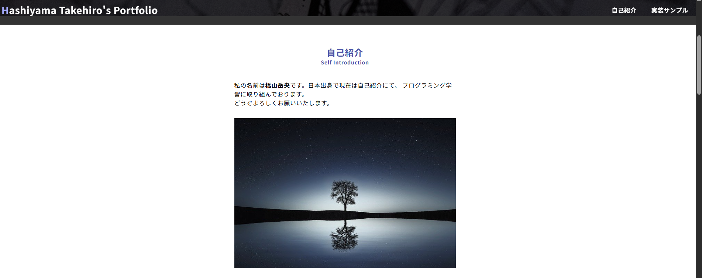
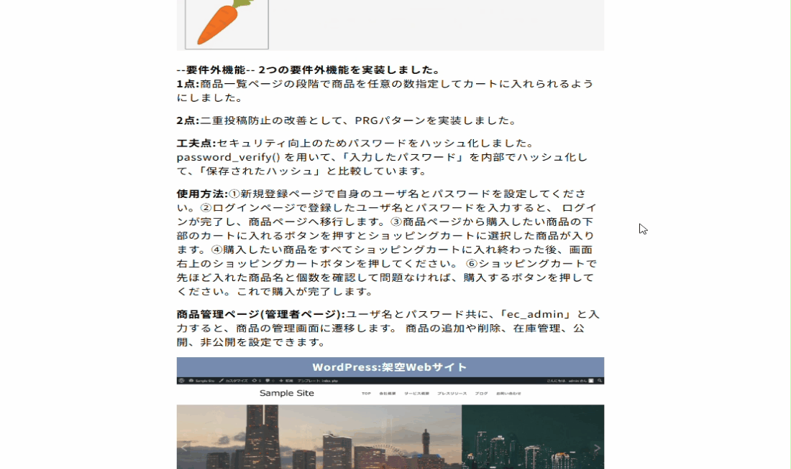
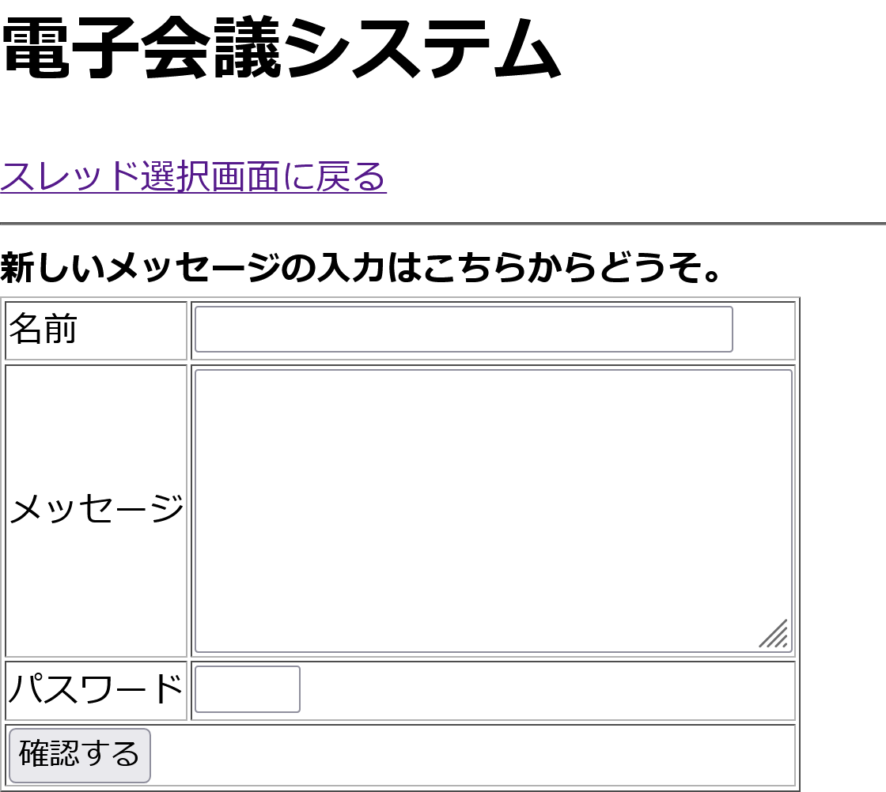

# 簡易ECサイト（学習用ポートフォリオ）(htdocs/ec_site)

## 📌 プロジェクト概要
PHPとMySQLを用いて作成した学習用の簡易ECサイトです。  
Webアプリ開発の基礎として、データベース設計・ユーザー管理・商品管理・カート機能・注文処理などを実装しました。  

## 🎯 制作の目的
- Webアプリケーション開発の流れを学習するため  
- データベースを利用したCRUD処理の理解を深めるため  
- フロントエンドとバックエンドを連携させた基本的な開発経験を積むため  

## 🛠 使用技術
- **言語**: PHP, HTML, CSS, JavaScript  
- **データベース**: MySQL  
- **その他**: Apache（XAMPP環境で動作確認）  

## ✨ 実装機能
- ユーザー登録 / ログイン機能  
- 商品一覧表示  
- カートに追加 / 削除  
- 注文処理（合計金額計算）  
- 管理者用の商品追加 / 更新 / 削除機能  

## 🗂 データベース設計
- `users`（ユーザー情報）  
- `products`（商品情報）  
- `orders`（注文情報）  
- `order_items`（注文ごとの商品明細）  

※ER図はREADMEに添付 

## URL
https://portfolio02.dc-itex.com/nakano/0005/ec_site/login.php  

MySQLログイン:  
ユーザー名:user  
BASIC認証パスワード：Zp5bfiaN

📷 スクリーンショット（任意）
- ログインページ
  
- 商品一覧ページ
  
- ER図  
  
- 画面遷移図
  

📌 備考

学習目的で制作したため、セキュリティやエラーハンドリングは簡略化しています。

実務ではCSRF対策・バリデーション強化などが必要です。

# 🎹 簡易ピアノアプリ（JavaScript実験版）(htdocs/js/index.html)

## 📌 プロジェクト概要
ブラウザ上で動作する学習用の簡易ピアノアプリです。  
Web Audio API を利用し、鍵盤のクリックで音を鳴らしたり、自動演奏機能で童謡を再生できます。  

## 🎯 制作の目的
- JavaScriptによるDOM操作・イベント処理の学習  
- Web Audio API を用いた音声生成の基礎理解  
- インタラクティブなUIの設計・実装の練習  

## 🛠 使用技術
- **言語**: HTML, CSS, JavaScript  
- **API**: Web Audio API  

## ✨ 実装機能
- 鍵盤クリックでの演奏機能（ド〜ドの音階）  
- 自動演奏機能（ランダムに楽曲を選曲して再生）  
- 演奏中は画面に曲名・現在の音階を表示  

## 🎶 対応曲
- きらきら星  
- チューリップ  
- かえるのうた  

## 🖥 デモ画面
- 鍵盤UI  
   
- 自動演奏UI  
 

## URL
https://portfolio02.dc-itex.com/nakano/0005/js/index.html

## 📌 備考
- 学習目的で制作した簡易アプリのため、デザインや機能は最小限です。  
- 今後の改善点として、キーボード入力対応や楽曲追加、レスポンシブ対応などを予定しています

# 🌐 自己紹介サイト（ポートフォリオ）(htdocs/index.html)

## 📌 プロジェクト概要
HTML / CSS / JavaScript を用いて制作した自己紹介用のポートフォリオサイトです。  
スキル紹介・制作サンプル・ギャラリーをまとめ、学習成果を整理しました。  

## 🎯 制作の目的
- Webサイト制作の基礎学習  
- レスポンシブデザインやUI実装の練習  
- 制作物のポートフォリオとしてまとめるため  

## 🛠 使用技術
- **言語**: HTML, CSS, JavaScript  
- **その他**: レスポンシブ対応（ハンバーガーメニュー）  

## ✨ 実装機能
- 自己紹介セクション（プロフィール・スキル・使用ツール）  
- 画像ギャラリー  
- 訓練課題（JavaScriptピアノアプリ / PHP ECサイト / WordPressサイト）へのリンク集  
- レスポンシブ対応ナビゲーション（ハンバーガーメニュー）  

## 📂 ファイル構成

htdocs/
├── index.html # 自己紹介サイト本体
├── style.css # スタイルシート
└── images/ # 使用画像


## 🖥 デモ画面
📷 スクリーンショット（任意）

- 自己紹介セクション  
  
- 作品サンプル表示画面
  

## URL
https://portfolio02.dc-itex.com/nakano/0005/index.html  

## 📌 備考
- 学習成果をまとめる目的で制作したサイトです。  
- 作品紹介部分は今後も追加・更新を予定しています。
# 電子会議システム（BBS）

PHPとMySQLで構築した簡易掲示板システムです。  
学習用教材の写経をもとに作成し、投稿・編集・削除・詳細確認の一連の機能を実装しています。

---
# （学習用ポートフォリオ）(htdocs/ec_site)

## 概要
- ユーザーはスレッドにメッセージを投稿可能
- 投稿内容は確認画面で確認した後、データベースに保存
- 投稿は編集・削除・詳細確認が可能
- パスワード（4桁）による認証機能を導入
- 投稿一覧は最大40文字まで表示し、超過時は「続きは詳細」を表示

---

## 主な機能
1. **スレッド選択・投稿**
   - `bbs_top.php`：スレッド選択画面（デフォルト thread=0）
   - `bbs_enter.php`：メッセージ入力画面と過去投稿一覧表示

2. **投稿確認・保存**
   - `confirm.php`：入力チェック（未入力やパスワード形式）、確認画面表示
   - `submit.php`：データベース保存、追加完了画面表示

3. **投稿編集**
   - `update.php`：編集画面表示
   - `update-confirm.php`：更新確認後にデータベース更新

4. **投稿削除**
   - `delete.php`：削除画面表示・パスワード入力
   - `delete-confirm.php`：削除確認画面
   - `delete-submit.php`：実際の削除処理

5. **投稿詳細確認**
   - `detail.php`：投稿内容の詳細表示
  
6. **サンプル画像**
   - `bbs_top.php` : 
    

---

## データベース
**テーブル名**：`discussion`

```sql
CREATE TABLE discussion (
    id INT(11) NOT NULL AUTO_INCREMENT,
    thread INT(11) NOT NULL,
    name VARCHAR(50) NOT NULL,
    message TEXT NOT NULL,
    passwd CHAR(4) NOT NULL,
    modified TIMESTAMP NOT NULL DEFAULT CURRENT_TIMESTAMP ON UPDATE CURRENT_TIMESTAMP,
    PRIMARY KEY (id)
) ENGINE=InnoDB DEFAULT CHARSET=utf8mb4;

