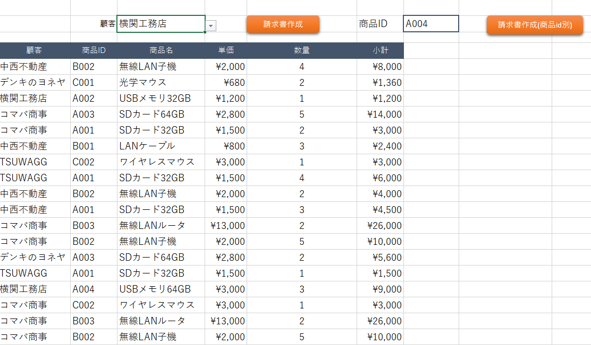

# 🛒 簡易ECサイト（学習用ポートフォリオ）(htdocs/ec_site)

## 📌 プロジェクト概要
PHPとMySQLを用いて作成した学習用の簡易ECサイトです。  
Webアプリ開発の基礎として、データベース設計・ユーザー管理・商品管理・カート機能・注文処理などを実装しました。  

## 🎯 制作の目的
- Webアプリケーション開発の流れを学習するため  
- データベースを利用したCRUD処理の理解を深めるため  
- フロントエンドとバックエンドを連携させた基本的な開発経験を積むため  

## 🛠 使用技術
- **言語**: PHP, HTML, CSS, JavaScript  
- **データベース**: MySQL  
- **その他**: Apache（XAMPP環境で動作確認）  

## ✨ 実装機能
- ユーザー登録 / ログイン機能  
- 商品一覧表示  
- カートに追加 / 削除  
- 注文処理（合計金額計算）  
- 管理者用の商品追加 / 更新 / 削除機能  

## 🗂 データベース設計
- `users`（ユーザー情報）  
- `products`（商品情報）  
- `orders`（注文情報）  
- `order_items`（注文ごとの商品明細）  

※ER図はREADMEに添付 

## URL
https://portfolio02.dc-itex.com/nakano/0005/ec_site/login.php  

MySQLログイン:  
ユーザー名:user  
BASIC認証パスワード：Zp5bfiaN

📷 スクリーンショット（任意）
- ログインページ
  
- 商品一覧ページ
  
- ER図  
  
- 画面遷移図
  

📌 備考

学習目的で制作したため、セキュリティやエラーハンドリングは簡略化しています。

実務ではCSRF対策・バリデーション強化などが必要です。

---

# 🎹 簡易ピアノアプリ（JavaScript実験版）(htdocs/js/index.html)

## 📌 プロジェクト概要
ブラウザ上で動作する学習用の簡易ピアノアプリです。  
Web Audio API を利用し、鍵盤のクリックで音を鳴らしたり、自動演奏機能で童謡を再生できます。  

## 🎯 制作の目的
- JavaScriptによるDOM操作・イベント処理の学習  
- Web Audio API を用いた音声生成の基礎理解  
- インタラクティブなUIの設計・実装の練習  

## 🛠 使用技術
- **言語**: HTML, CSS, JavaScript  
- **API**: Web Audio API  

## ✨ 実装機能
- 鍵盤クリックでの演奏機能（ド〜ドの音階）  
- 自動演奏機能（ランダムに楽曲を選曲して再生）  
- 演奏中は画面に曲名・現在の音階を表示  

## 🎶 対応曲
- きらきら星  
- チューリップ  
- かえるのうた  

## 🖥 デモ画面
- 鍵盤UI  
   
- 自動演奏UI  
 

## URL
https://portfolio02.dc-itex.com/nakano/0005/js/index.html

## 📌 備考
- 学習目的で制作した簡易アプリのため、デザインや機能は最小限です。  
- 今後の改善点として、キーボード入力対応や楽曲追加、レスポンシブ対応などを予定しています

---

# 🌐 自己紹介サイト（ポートフォリオ）(htdocs/index.html)

## 📌 プロジェクト概要
HTML / CSS / JavaScript を用いて制作した自己紹介用のポートフォリオサイトです。  
スキル紹介・制作サンプル・ギャラリーをまとめ、学習成果を整理しました。  

## 🎯 制作の目的
- Webサイト制作の基礎学習  
- レスポンシブデザインやUI実装の練習  
- 制作物のポートフォリオとしてまとめるため  

## 🛠 使用技術
- **言語**: HTML, CSS, JavaScript  
- **その他**: レスポンシブ対応（ハンバーガーメニュー）  

## ✨ 実装機能
- 自己紹介セクション（プロフィール・スキル・使用ツール）  
- 画像ギャラリー  
- 訓練課題（JavaScriptピアノアプリ / PHP ECサイト / WordPressサイト）へのリンク集  
- レスポンシブ対応ナビゲーション（ハンバーガーメニュー）  

## 📂 ファイル構成

htdocs/
├── index.html # 自己紹介サイト本体
├── style.css # スタイルシート
└── images/ # 使用画像

## 🖥 デモ画面
📷 スクリーンショット（任意）

- 自己紹介セクション  
  
- 作品サンプル表示画面
  

## URL
https://portfolio02.dc-itex.com/nakano/0005/index.html  

## 📌 備考
- 学習成果をまとめる目的で制作したサイトです。  
- 作品紹介部分は今後も追加・更新を予定しています。

---

# 🌐 事務職向けポートフォリオ (htdocs/事務職用ポートフォリオ/index.html)

## 📌 プロジェクト概要
- Excel・Word・Googleスプレッドシート・Googleドキュメント・Googleスライドなどを活用し、事務職での作業能力を可視化するために制作したポートフォリオです。
- データ入力、資料作成、集計や報告書作成のスキルを整理し、業務での実践例をまとめています。

## 🎯 制作の目的
- 事務作業のスキルや経験を整理・可視化する
- 採用担当者に、正確性・効率性・作業の丁寧さを伝える
- ポートフォリオとして、自己PRや面接時の補助資料に活用する

## 🛠 使用技術・ツール
- Word / Excel / PowerPoint / Google Workspace（Docs, Sheets, Slides）
- HTML / CSS / JavaScript（自己紹介サイトでポートフォリオをWeb表示する場合）
- データ整理・表計算・グラフ作成・簡易マクロ

## ✨ 実装機能・収録内容
- プロフィール・経歴・スキル紹介セクション
- 成果物カード（Word・Excel・Googleドキュメント・スプレッドシート・スライド）
- サンプルデータ表示（スクリーンショットやリンク）
- ダウンロード可能なExcelファイルや資料リンク
- レスポンシブ対応ナビゲーション（Web版の場合）

## 📂 ファイル構成
htdocs/事務職用ポートフォリオ/
├── index.html # ポートフォリオ本体
├── style.css # スタイルシート
├── images/ # 使用画像・スクリーンショット
└── files/ # Excel・Word等の成果物

## 🖥 デモ画面（任意）
📷 自己紹介・プロフィールセクション

## URL
https://portfolio02.dc-itex.com/nakano/0005/%E4%BA%8B%E5%8B%99%E8%81%B7%E7%94%A8%E3%83%9D%E3%83%BC%E3%83%88%E3%83%95%E3%82%A9%E3%83%AA%E3%82%AA/index.html

---

# 🪧電子会議システム（BBS）(htdocs/online forum)

PHPとMySQLで構築した簡易掲示板システムです。  
学習用教材の写経をもとに作成し、投稿・編集・削除・詳細確認の一連の機能を実装しています。

## 概要
- ユーザーはスレッドにメッセージを投稿可能
- 投稿内容は確認画面で確認した後、データベースに保存
- 投稿は編集・削除・詳細確認が可能
- パスワード（4桁）による認証機能を導入
- 投稿一覧は最大40文字まで表示し、超過時は「続きは詳細」を表示

## URL:  
https://portfolio02.dc-itex.com/nakano/0005/Lesson14/Lesson14/bbs_enter.php?thread=0

## 主な機能
1. **スレッド選択・投稿**
   - `bbs_top.php`：スレッド選択画面（デフォルト thread=0）
   - `bbs_enter.php`：メッセージ入力画面と過去投稿一覧表示

2. **投稿確認・保存**
   - `confirm.php`：入力チェック（未入力やパスワード形式）、確認画面表示
   - `submit.php`：データベース保存、追加完了画面表示

3. **投稿編集**
   - `update.php`：編集画面表示
   - `update-confirm.php`：更新確認後にデータベース更新

4. **投稿削除**
   - `delete.php`：削除画面表示・パスワード入力
   - `delete-confirm.php`：削除確認画面
   - `delete-submit.php`：実際の削除処理

5. **投稿詳細確認**
   - `detail.php`：投稿内容の詳細表示
  
6. **サンプル画像**
   - `bbs_top.php` : 
    

## データベース
**テーブル名**：`discussion`

```sql
CREATE TABLE discussion (
    id INT(11) NOT NULL AUTO_INCREMENT,
    thread INT(11) NOT NULL,
    name VARCHAR(50) NOT NULL,
    message TEXT NOT NULL,
    passwd CHAR(4) NOT NULL,
    modified TIMESTAMP NOT NULL DEFAULT CURRENT_TIMESTAMP ON UPDATE CURRENT_TIMESTAMP,
    PRIMARY KEY (id)
) ENGINE=InnoDB DEFAULT CHARSET=utf8mb4;
```
---
# 🎲 すごろくレースゲーム（Java簡易版）(htdocs/CU2001010607_java_report13.java)
## 📌 プロジェクト概要

Javaで作成した、コンソール上で遊べる学習用のすごろくレースゲームです。
複数プレイヤー（最大4人）が順番にサイコロを振り、体力を管理しながらゴールを目指します。
特殊マスや体力管理、脱落判定などを通して、簡単ながら戦略要素を取り入れています。

## 🎯 制作の目的

Javaの基本文法（クラス・配列・メソッド・制御構文）の理解

オブジェクト指向設計の学習（Playerクラスで状態管理）

ユーザー入力・条件分岐・ゲームループ処理の実践

コンソール上でのインタラクティブアプリ作成の練習

## 🛠 使用技術

言語: Java

開発環境: 任意のJavaコンパイラ／IDE

ランダム操作: java.util.Random

入力処理: java.util.Scanner

## ✨ 実装機能

複数プレイヤー同時プレイ（最大4人）

サイコロを振って進むターン制ゲーム

体力管理: 体力が0になると脱落

特殊マス処理:

一回休みマス

回復マス（体力回復 or サイコロ追加）

ダメージマス（体力減少）

脱落人数とゴール状況のリアルタイム表示

誰もゴールできなかった場合もゲーム終了判定

## 🖥 ゲーム画面例（コンソール）
すごろくゲームへようこそ！
プレイヤーは最大4人まで参加
playerの人数(1〜4)を入力してください: 2
Enterキーを押してゲームを開始します。

--------ターン1----------
プレイヤー1の番です。Enterキーを押してサイコロを振ってください...
サイコロの目は 4 です。
プレイヤー1 現在の位置: 4 | 体力値: 16

プレイヤー1: □□□□●□□□□□□□□□□□□
プレイヤー2: ●□□□□□□□□□□□□□□□

...
プレイヤー2は体力0で脱落しました。
脱落人数: 1

## URL

※ポートフォリオ内でソース参照用、または実行環境に応じてリンクを記載してください。

## 📌 備考

学習目的で制作した簡易ゲームのため、UIはコンソール出力のみです。

今後の改善案として、GUI化やAIプレイヤーの導入、難易度調整などを検討可能です。

---

## 📚 請求書の自動生成マクロ(htdocs/請求書VBA/販売管理成果物_最新版.xlsm)

このプロジェクトは、ExcelのVBAを用いて請求書を自動作成するマクロを学習用として作成したものです。
売上データから請求先ごとの請求書を自動で作成できるようにし、データ集計から請求書出力までの一連の操作を簡略化することを目的としています。

## 使用技術

Excel（Microsoft Office）

VBA（Visual Basic for Applications）

## 主な機能

請求先情報を自動で請求書シートに転記

売上データをフィルターして該当データをコピー

請求書の既存内容をクリアして新しいデータを貼り付け

売上合計や税込金額の表示

入力チェック（D2セル未入力時のエラーメッセージ表示）

## 使い方

請求したい顧客をプルダウンから選択

請求書作成をクリック

「請求書」シートに請求先ごとの請求書が自動で作成される

必要に応じてPDF保存や印刷が可能

## サンプル画像


## 学習ポイント

Excelデータのフィルター・コピー・貼り付け操作をVBAで自動化

シート間のデータ転記・クリア操作

条件付き処理やループを用いたデータ集計

---

## 事務職用のポートフォリオ

## URL
https://portfolio02.dc-itex.com/nakano/0005/%25E4%25BA%258B%25E5%258B%2599%25E8%2581%25B7%25E7%2594%25A8%25E3%2583%259D%25E3%2583%25BC%25E3%2583%2588%25E3%2583%2595%25E3%2582%25A9%25E3%2583%25AA%25E3%2582%25AA/index.html
